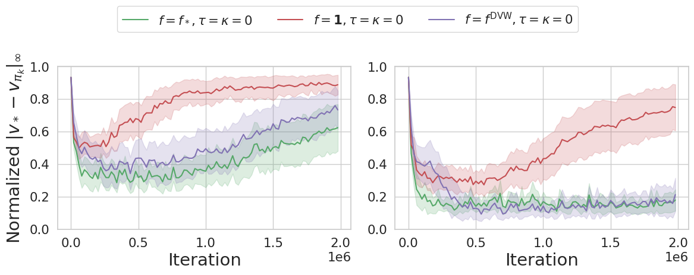
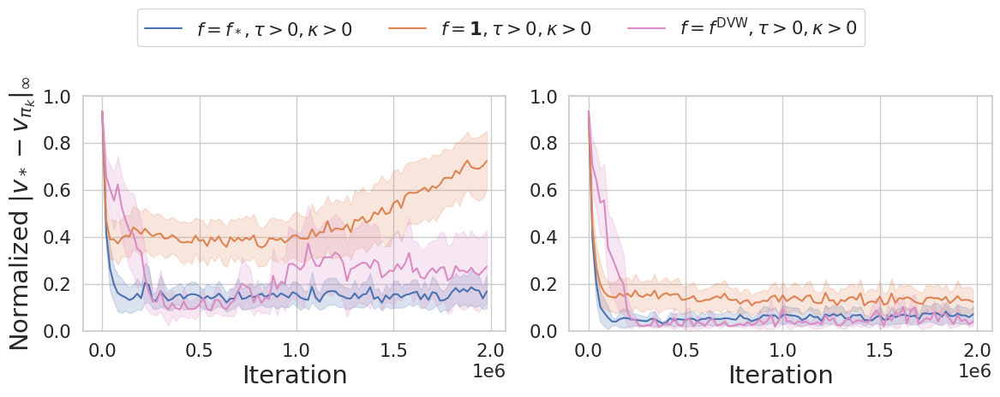

# Official Implementation of Deep Variance Weighting (DVW)

This repository is the official implementation of Deep Variance Weighting proposed in [Regularization and Variance-Weighted Regression Achieves Minimax Optimality in Linear MDPs: Theory and Practice](TODO).

* We modified [ShinRL](https://github.com/omron-sinicx/ShinRL/tree/main) repository (commit[09f4ae2](https://github.com/omron-sinicx/ShinRL/commit/09f4ae274a33d1fc1d9d542f816aef40014af6b5)).
* You can see the implementation of M-DQN with DVW in [shinrl/solvers/discrete_vi/solver.py](shinrl/solvers/discrete_vi/solver.py)






## Requirements

* Clone and install the repository

```bash
# Install CleanRL
git clone https://github.com/matsuolab/Deep-Variance-Weighting-Maze.git && cd Deep-Variance-Weighting-Maze
poetry install
```

You can test if everything works by:

```bash
poetry run python experiments/run_generative.py --weight_mode dvw --seed 0 --maze_seed 1 --maze_eps 0.1 --iteration 10000 --maze_size 25 --num_pitfall 8 --num_samples_target 3 --is_munchausen
```

## Run Maze Experiments

Run ```bash experiments/start_job.bash```


## Plot results

Run ```poetry run python experiments/plot_all_results.py```
The figures will be saved in ```experiments/results/0.1-3/optimality-gap.png``` and ```experiments/results/0.1-10/optimality-gap.png```.

